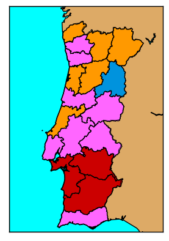
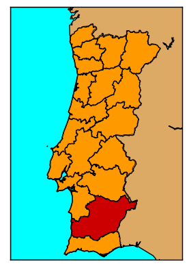
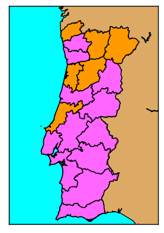

# Aula Laboratorial 09

Nesta aula vamos treinar fazer mapas no matplotlib, utilizando a extensão basemap.

O objectivo é fazer um programa que gere automáticamente mapas a partir de dados eleitorais. Pretende-se que, para um dado ano, cada distrito de Portugal seja desenhado com a cor do partido que foi mais votado nesse distrito.

Por exemplo, em 1976, houve distritos que votaram no PS (rosa), PSD (laranja), CDS (azul) e PCP (vermelho):




Já em 1991 a maioria dos distritos votaram no PSD.



Em 1995, a maioria votou no PS:



O objectivo deste trabalho é fazer um programa que produza imagens como estas para todos os anos das eleições dos dados que temos.

Vai ser necessário:

* Instalar o basemap - vê este tutorial: [link](https://stackoverflow.com/questions/18109859/how-to-install-matplotlib-basemap-module-on-windows-7-with-winpython-or-any-pyt)

* Obter os dados - saca os ficheiros `distritos.json` e `resultados-legislativas.csv` do github da cadeira.

* Ler os dados:

  * Definir métodos para extrair os dados necessários do ficheiro `resultados-legislativas.csv`

    Podemos excluír dos dados todas as entradas cuja coluna `nome` seja uma das seguintes: `'Corvo', 'São Miguel', 'Europa',  'São Jorge', 'Fora da Europa', 'Emigração', 'Moçambique', 'Macau'`

    (Dica: estes dados foram tratados na aula teórica 4)

  * Defina métodos para extrair os polígonos de cada distrito de Portugal do ficheiro `distritos.json`

    (Dica: estes dados foram tratados na aula teórica 16)

* Ordenar os dados: define métodos que seleccionem todas as entradas correspondentes a um dado ano, e que para cada distrito seleccionem apenas a entrada correspondente ao partido com mais votos. Dica - ordenar por distrito e por número de votos, e guardar sómente a primeira entrada para cada distrito.

* Definir um método que desenhe um mapa com todos os resultados para um dado ano, e guardar num ficheiro. Algures poderá ter a instrução:

  ```plt.savefig('resultados_{0}.png'.format(ano),bbox_inches='tight')```

* Aplicar esse método num ciclo para cada ano disponível na base de dados.

Pode ser utilizado o seguinte mapa entre nomes-de-partido e cores:

```python
cores_partido = {
    'PPD': '#FF9900', 'PS': '#FF66FF', 'CDS': '#0093DD', 'MDP': 'gray',
    'PCP': '#CC0000', 'MES': 'gray', 'FEC': 'gray', 'PUP': 'gray', 
    'UDP': 'gray', 'FSP': 'gray', 'PPM': 'gray', 'LCI': 'gray', 
    'ADIM': 'gray', 'CDM': 'gray', 'MRPP': 'gray', 'AOC': 'gray', 
    'PDC': 'gray', 'PCP (M-L)': 'gray', 'PRT': 'gray', 'PSD': 'gray',
    'APU': '#CC0000', 'PCTP/MRPP': '#CC0000', 'PSR': 'gray', 
    'AD': '#FF9900', 'UEDS': 'gray', 'POUS': '#FF0000', 'OCMLP': 'gray',
    'UDA/PDA': 'gray', 'POUS/PST': 'gray', 'PT': 'gray', 'FRS': 'gray',
    'PDC/MIRN-PDP/FN': 'gray', 'PPD/PSD': '#FF9900', 'PDA': 'gray', 
    'LST': 'gray', 'UDP/PSR': 'gray', 'PC(R)': 'gray', 'PRD': 'gray',
    'CDU': '#CC0000', 'MDP/CDE': 'gray', 'PSN': 'gray', 'FER': 'gray',
    'CDS-PP': '#0093DD', 'PPM/MPT': '#013220', 'PG': 'gray', 
    'MPT': '#013220', 'MUT': 'gray', 'BE': '#8B0000', 'PH': 'gray',
    'PNR': 'gray', 'PND': 'gray', 'MEP': 'gray', 'MMS': 'gray', 
    'PPV': 'gray', 'MPT-PH': '#013220', 'PTP': '#CC0000', 'PAN': '#2C8028'}
```

## Pontos extra

As seguintes tarefas resultarão em pontos extra, que poderão servir para compensar resultados piores noutros TPC. (A nota máxima da cadeira mantém-se o 17.)

* Faz um programa que em vez de criar ficheiros de imagem tem um radiobox (semelhante ao checkbox da teórica 14, mas um radiobox é diferente de um checkbox, só permite escolher uma opção de cada vez), em que é possível escolher o ano, e que mostra o mapa para o ano escolhido. (2 pontos de bónus)
* Cria uma imagem que contenha não sómente Portugal continental, mas também as ilhas (1.5 pontos de bónus) Nota que nos dados a eleição de 1975 tem as várias ilhas dos açores separadas (São Miguel, Corvo, São Jorge). Aglomera estes dados num só conjunto de entradas para os Açores, de modo a que se possa também fazer plot do ano de 1975 (1 ponto de bónus).

